#  CyberDefender-SIEM

A Mini Security Information and Event Management (SIEM) Tool developed using Python.

## Project Overview

Mini Security Information and Event Management (SIEM) Tool

A Python-based cybersecurity project that collects security logs, stores them in a SQLite database, detects suspicious activities, and generates alerts. This project is being developed over 30 days as an internship portfolio project.

## Technologies Used

- Python
- SQLite
- VS Code
- Git
- GitHub

---

# Day 1

## Features
- Project Setup
- Log Collection
- Log Parsing

## Files
- main.py
- src/log_collector.py
- src/parser.py
- logs/system.log

---

# Day 2

## Features
- SQLite Database Integration
- Automatic Table Creation
- Log Storage
- Persistent Security Logs

## Files Added
- src/database.py
- database/siem.db

---

## Day 3

### Features
- Threat Detection Module
- Failed Login Detection
- Displayed Security Alerts

### Files Added

- src/detector.py

---

## Day 4 – Alert Engine

### Features
- Implemented Alert Engine
- Saved security alerts into a CSV file
- Generated alerts for failed login attempts

### Technologies
- Python
- CSV
- SQLite

## 🚨 Day 4 - Alert Engine

The Alert Engine analyzes security logs and generates alerts whenever suspicious activities such as multiple failed login attempts are detected.

### Alert Engine Screenshot

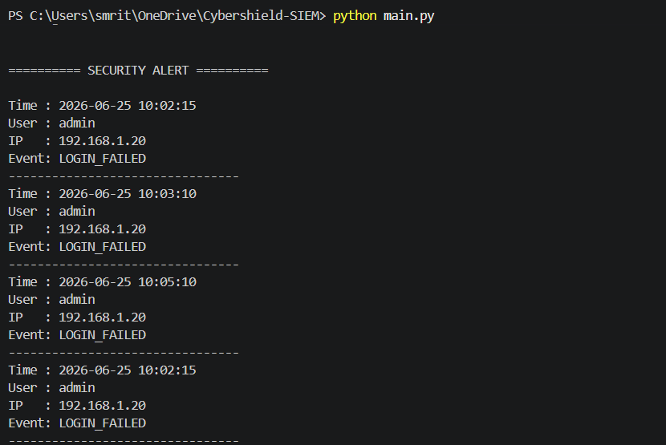

---

## Day 5

Implemented a SIEM Dashboard that displays:

- Total Logs
- Successful Login Attempts
- Failed Login Attempts
- Real-time Log Statistics

---

## Day 6 – Brute Force Attack Detection

### Features

- Detects repeated failed login attempts.
- Identifies suspicious IP addresses.
- Generates CRITICAL alerts for brute-force attacks.
- Uses SQL GROUP BY and HAVING for attack detection.

## 🚨 Day 6 - Brute Force Attack Detection

The SIEM system detects repeated failed login attempts from the same IP address and raises a **CRITICAL** brute force attack alert.

### Brute Force Detection

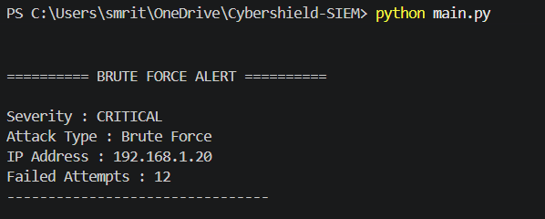

---

## Day 7 – Log Severity Classification

### Features
- Detects failed login attempts.
- Identifies brute-force attacks.
- Classifies logs based on severity.
- Displays a security dashboard.
- Stores alerts in CSV format.

### Technologies
- Python
- SQLite
- CSV
- Git
- GitHub

## 🚨 Day 7 - Log Severity Classification

The SIEM system classifies security events based on their severity level.

- 🟢 LOW – Successful login events
- 🔴 HIGH – Failed login events

### Log Severity Classification

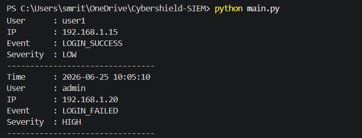

---

## ✅ Day 8 - Email Alert Notification

### New Feature
- Sends email alerts automatically when HIGH severity events are detected.
- Uses Gmail SMTP with App Password authentication.
- Notifies the administrator instantly.

## 📧 Day 8 - Email Alert Notification

### Terminal Output

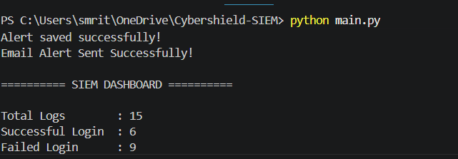

### Email Received

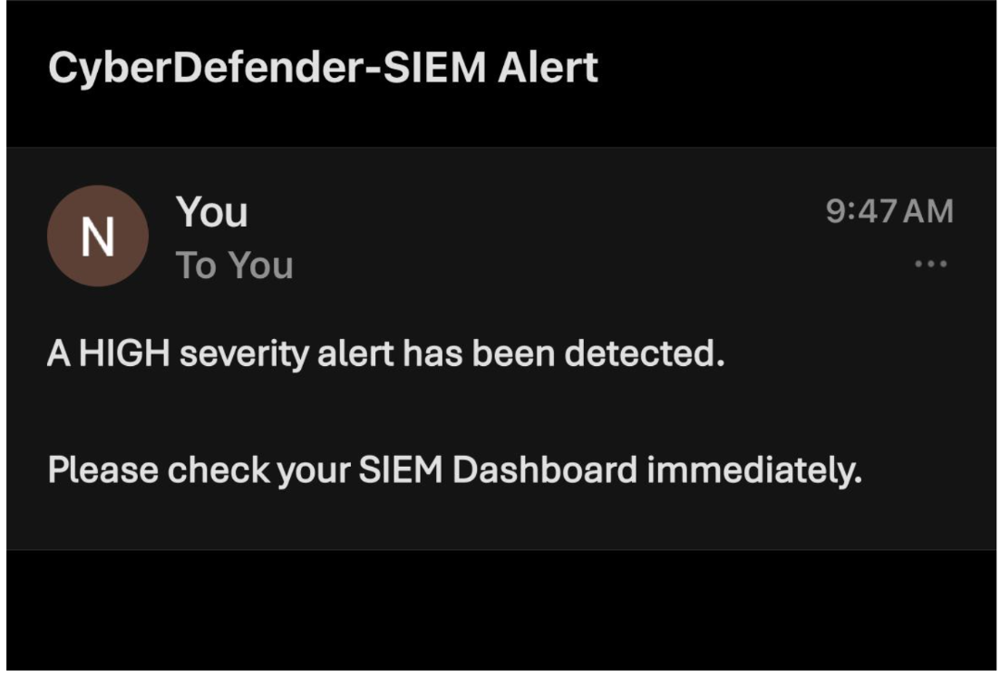

---

## ✅ Day 9 - Flask Web Dashboard

### New Features
- Developed a web-based SIEM dashboard using Flask.
- Connected the dashboard with the SQLite database.
- Displays:
  - Total Logs
  - Successful Login Attempts
  - Failed Login Attempts
  - Recent Security Logs
- Dynamic dashboard that updates using data stored in the database.
- Simple and user-friendly web interface.

### Technologies Used
- Python
- Flask
- SQLite
- HTML
- CSS

## 📸 Dashboard Screenshot

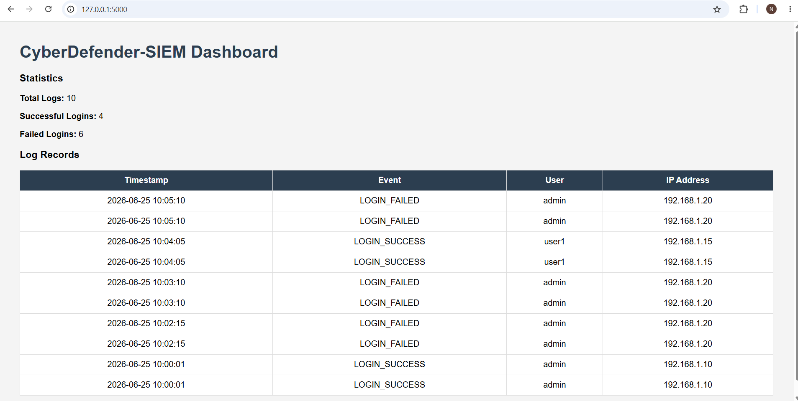

---

## 📅 Day 10 - Recent Alerts Dashboard

### 🚀 Features Added

- Developed a dedicated **Recent Alerts Dashboard** using Flask.
- Displays only the latest failed login attempts in a separate web interface.
- Shows detailed information including **Timestamp, User, IP Address, and Event**.
- Improved dashboard readability by displaying only the most recent records.
- Enhanced the SIEM monitoring interface for quick analysis of suspicious login activities.

### 🛠 Tools & Technologies Used

- Python
- Flask
- SQLite
- HTML
- Jinja2 Templates
- Visual Studio Code

### 📸 Dashboard Overview

Displays an overview of the SIEM statistics including total logs, successful logins, failed logins, and recent log records.

### 📸 Recent Alerts Dashboard

Displays the latest failed login attempts separately, making it easier to monitor suspicious activities in real time.

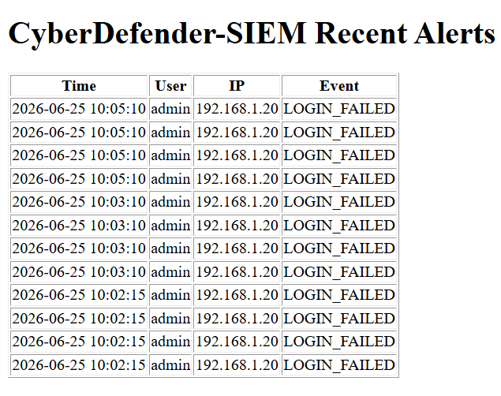

---

## 📅 Day 11 - Search & Filter Dashboard

### 🚀 Features Added

- Added search functionality to filter logs by username.
- Added event filtering for LOGIN_SUCCESS and LOGIN_FAILED.
- Improved dashboard usability with dynamic log filtering.
- Displays only relevant log records based on user input.

### 🛠 Tools & Technologies Used

- Python
- Flask
- SQLite
- HTML
- Jinja2 Templates
- Visual Studio Code

### 📸 Search by Username

Search logs based on a specific username to quickly locate user activities.

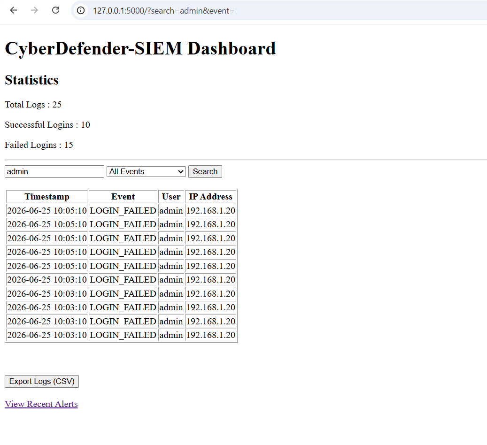

### 📸 Filter by Event Type

Filter logs to display only `LOGIN_SUCCESS` or `LOGIN_FAILED` events for easier security analysis.

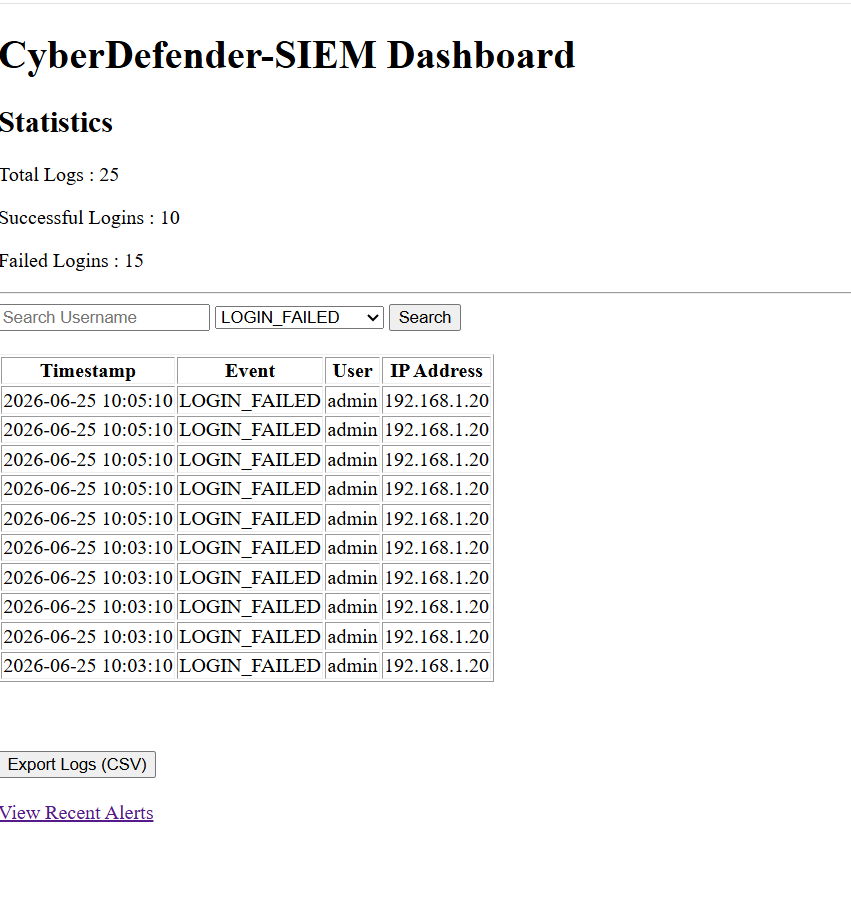

### 📸 Export Logs to CSV

Download SIEM logs in CSV format for reporting, auditing, and further analysis.

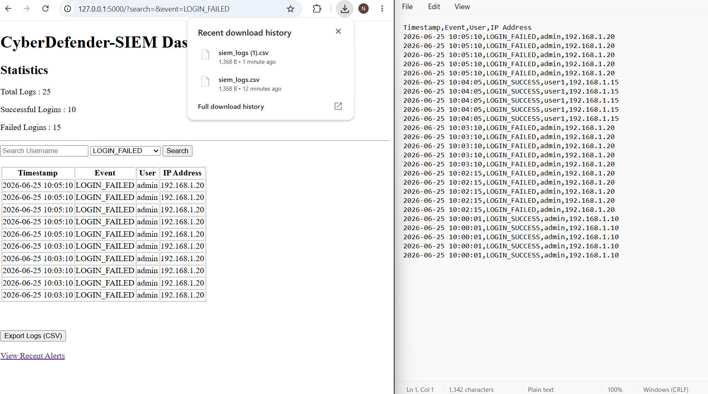

---

## 📅 Day 12 - Professional Dashboard UI

### 🚀 Features Added

- Redesigned the SIEM dashboard with a modern professional interface.
- Added responsive dashboard cards for log statistics.
- Improved table layout and readability.
- Styled search, filter, and export buttons.
- Added a professional footer and consistent color theme.
- Enhanced user experience with hover effects and clean typography.

### 🛠 Tools & Technologies Used

- Python
- Flask
- HTML5
- CSS3
- SQLite
- Jinja2
- Visual Studio Code

### 📸 Professional Dashboard

The dashboard was redesigned with a clean and modern interface to improve usability and provide a professional SIEM monitoring experience.

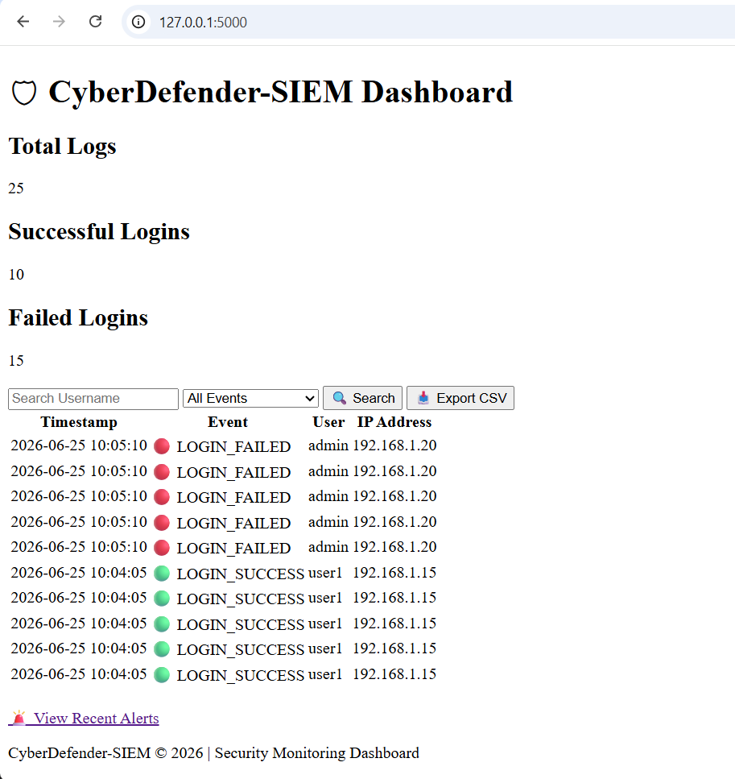

---

## 📅 Day 13 - IP Reputation & Threat Intelligence

### 🚀 Features Added

- Integrated an IP Reputation Engine into the SIEM dashboard.
- Classified IP addresses as **Trusted**, **Suspicious**, **Blacklisted**, or **Unknown**.
- Added a new **Reputation** column to the dashboard.
- Displayed color-coded reputation badges for quick threat identification.
- Enhanced security monitoring by identifying potentially malicious IP addresses.
- Improved dashboard usability with real-time threat intelligence.

### 🛠 Tools & Technologies Used

- Python
- Flask
- SQLite
- HTML5
- CSS3
- Jinja2
- Visual Studio Code

### 📸 IP Reputation Dashboard

The dashboard now displays the reputation status of each IP address, allowing users to quickly distinguish between trusted and potentially malicious sources.

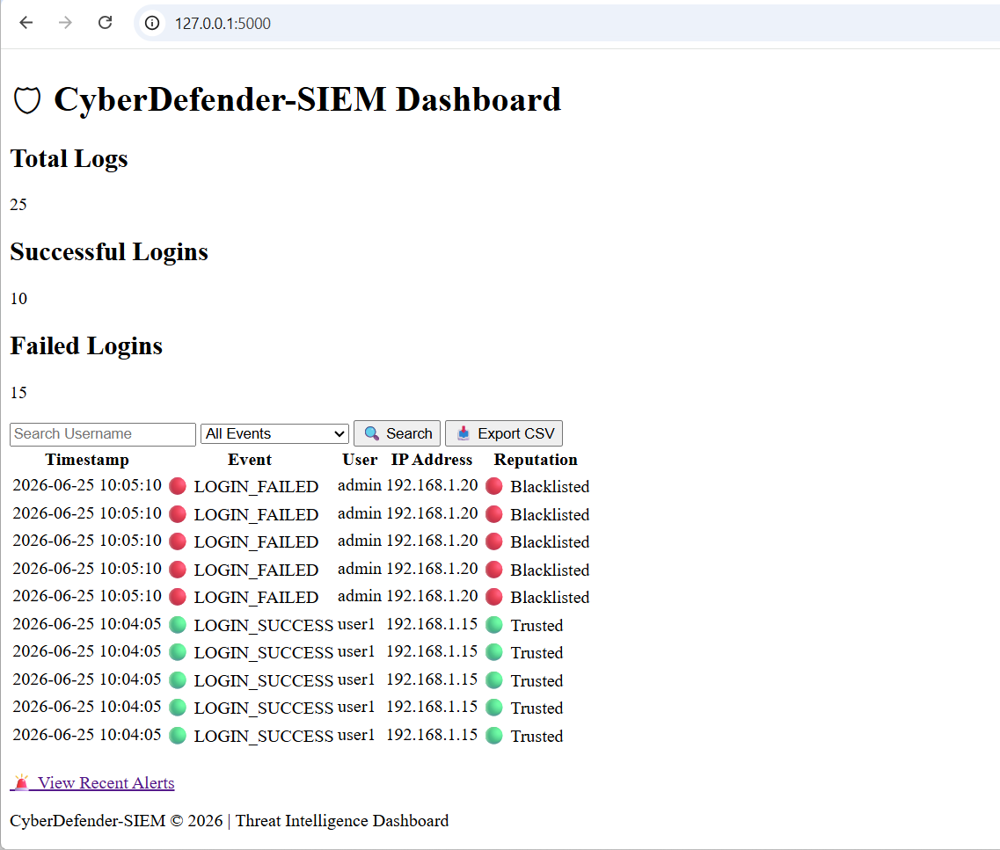

### 📸 Blacklisted IP Detection

Search and filtering features can be used to quickly identify blacklisted IP addresses associated with failed login attempts, improving threat analysis and incident response.

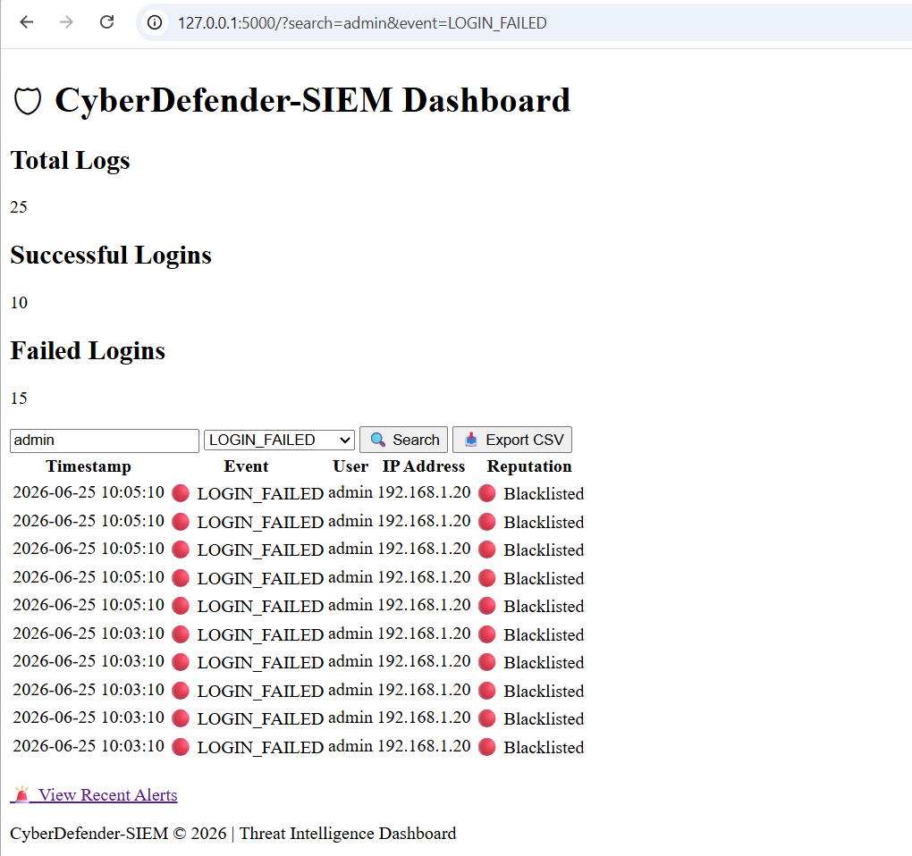

---

## 📅 Day 14 - User Activity Report & Login Analytics

### 🚀 Features Added

- Added a dedicated **User Activity Report** page.
- Displayed user-wise login statistics.
- Counted successful logins for each user.
- Counted failed logins for each user.
- Calculated total activity for every user.
- Added a navigation button from the dashboard to the User Activity Report page.
- Improved SIEM reporting and auditing capabilities with a clean tabular interface.

### 🛠 Tools & Technologies Used

- Python
- Flask
- SQLite
- HTML5
- CSS3
- Jinja2
- Visual Studio Code

### 📸 User Activity Report

The User Activity Report provides a summary of successful logins, failed logins, and total activity for each user, making it easier to monitor user behavior.

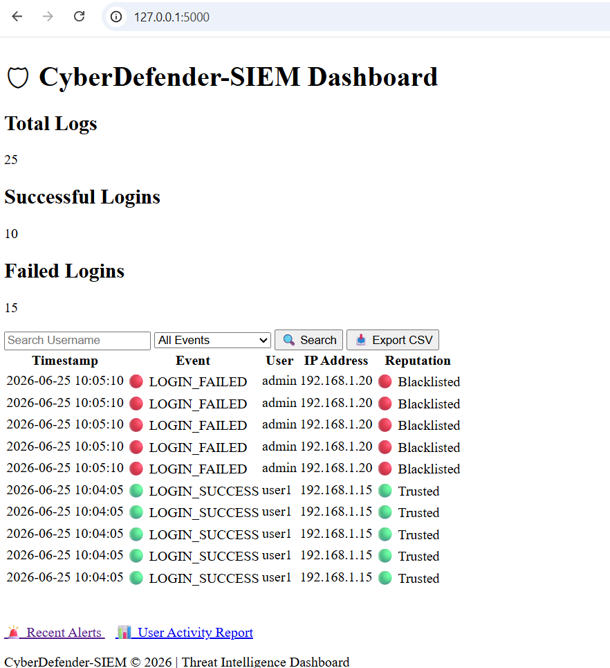

### 📸 Dashboard Navigation

The dashboard now includes a dedicated **User Activity Report** button for quick access to user login analytics.

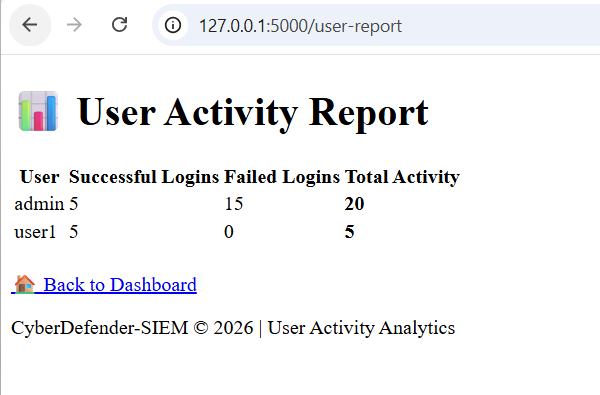

---

## 📅 Day 15 - Security Analytics Dashboard

### 🚀 Features Added

- Added a dedicated **Security Analytics Dashboard**.
- Displayed total successful logins.
- Displayed total failed logins.
- Identified the most targeted user.
- Identified the most attacking IP address.
- Added an analytics summary table.
- Integrated Security Analytics navigation into the main dashboard.
- Enhanced SIEM reporting with security insights.

### 🛠 Tools & Technologies Used

- Python
- Flask
- SQLite
- HTML5
- CSS3
- Jinja2
- Visual Studio Code

### 📸 Security Analytics Dashboard

The Security Analytics Dashboard provides a summary of login activity, identifies the most targeted user, highlights the most attacking IP address, and displays overall security statistics.

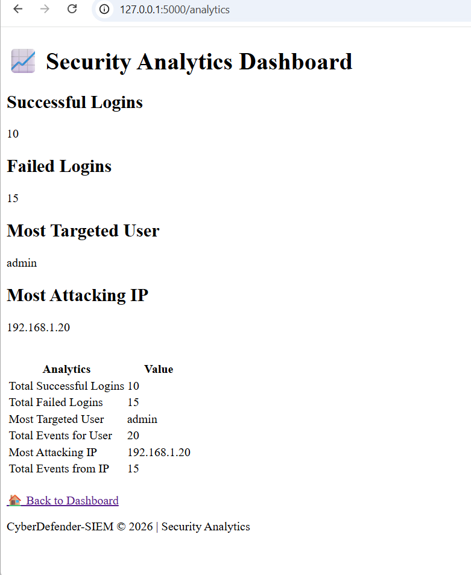

### 📸 Dashboard Navigation

The main dashboard now includes a dedicated **Security Analytics** button for quick access to security insights.

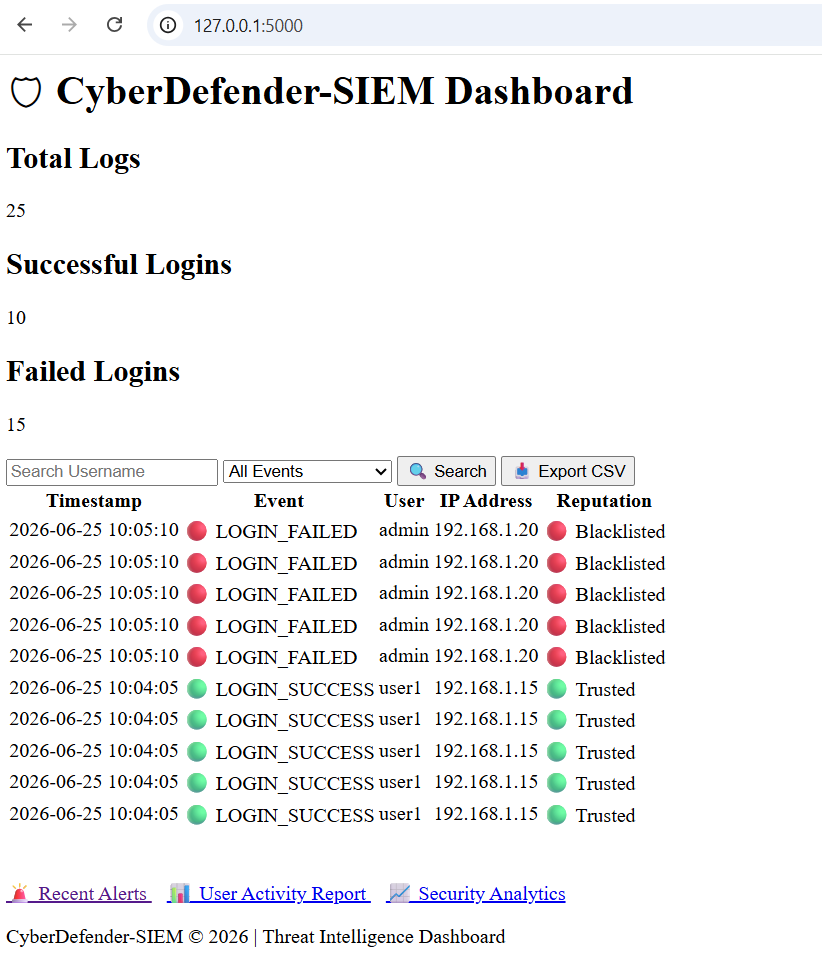

---

## 📅 Day 16 - Login Activity Timeline

### 🚀 Features Added

- Added a dedicated **Login Activity Timeline** page.
- Displays all login events in chronological order.
- Shows login timestamp, event type, username, and IP address.
- Highlights successful logins with green indicators.
- Highlights failed logins with red indicators.
- Integrated **Login Timeline** navigation into the main dashboard.
- Improves incident investigation by providing a clear sequence of login activities.

### 🛠 Tools & Technologies Used

-python
- Flask
- SQLite
- HTML5
- CSS3
- Jinja2
- Visual Studio Code

### 📸 Login Activity Timeline

The Login Activity Timeline provides a chronological view of all login events, allowing security analysts to review user activity and investigate suspicious login attempts.

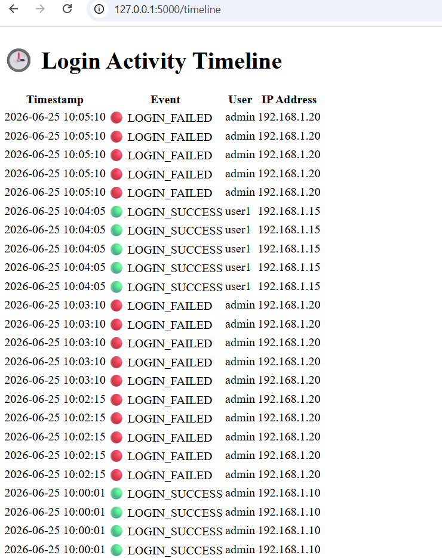

### 📸 Dashboard Navigation

The main dashboard now includes a dedicated **Login Timeline** button for quick access to the chronological event history.

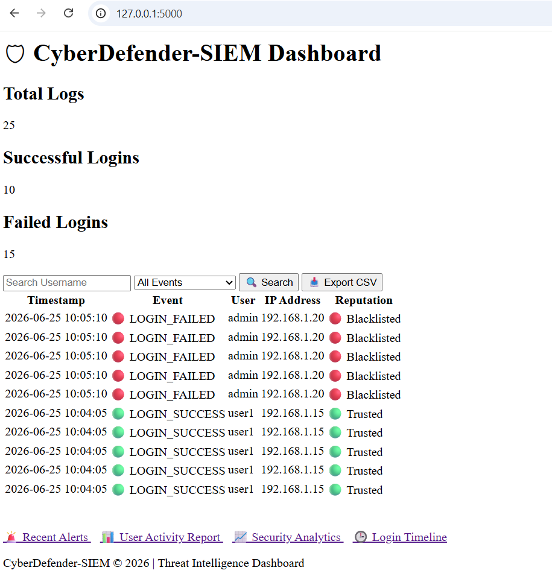

---

## 📅 Day 17 - Failed Login Trends

### 🚀 Features Added

- Added a dedicated **Failed Login Trends** page.
- Displays failed login attempts grouped by IP address.
- Identifies IP addresses with the highest number of failed login attempts.
- Helps detect suspicious login patterns and potential brute-force attacks.
- Added **Failed Login Trends** navigation to the main dashboard.
- Enhanced the SIEM dashboard with IP-based security insights.

### 🛠 Tools & Technologies Used

- Python
- Flask
- SQLite
- HTML5
- CSS3
- Jinja2
- Visual Studio Code

### 📸 Failed Login Trends

The Failed Login Trends page provides a summary of failed login attempts by IP address, allowing security analysts to quickly identify suspicious or potentially malicious sources.

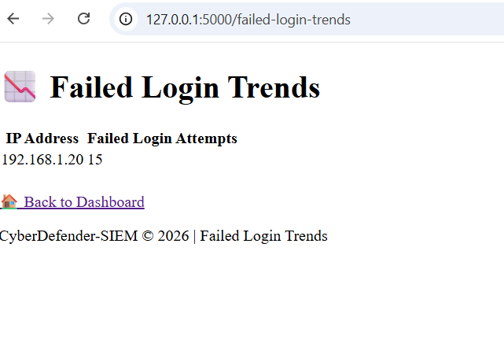

### 📸 Dashboard Navigation

The main dashboard now includes a dedicated **Failed Login Trends** button for quick access to IP-wise failed login statistics.

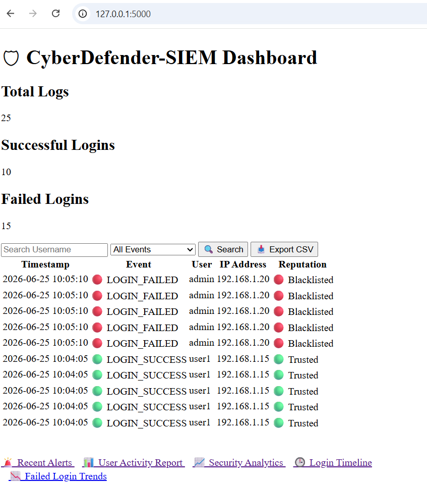

---

## 📅 Day 18 - Top Active Users Dashboard

### 🚀 Features Added

- Added a dedicated **Top Active Users** dashboard.
- Displays users ranked by total login activity.
- Shows the total number of login events for each user.
- Displays successful and failed login counts separately.
- Helps identify highly active user accounts for security monitoring.
- Integrated **Top Active Users** navigation into the main dashboard.
- Enhanced SIEM reporting with user activity insights.

### 🛠 Tools & Technologies Used

- Python
- Flask
- SQLite
- HTML5
- CSS3
- Jinja2
- Visual Studio Code

### 📸 Top Active Users Dashboard

The Top Active Users dashboard provides a ranked overview of user activity by displaying total login events, successful logins, and failed login attempts for each user. This helps security analysts quickly identify highly active accounts and monitor user behavior.

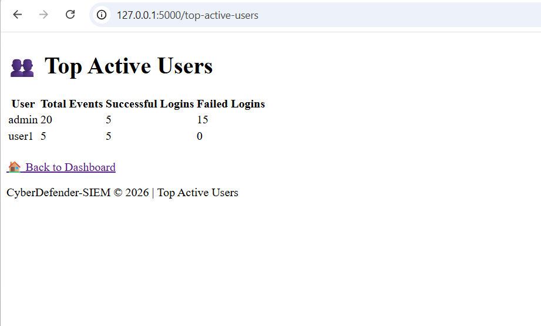

### 📸 Dashboard Navigation

The main dashboard now includes a dedicated **Top Active Users** button for quick access to user activity statistics and monitoring.

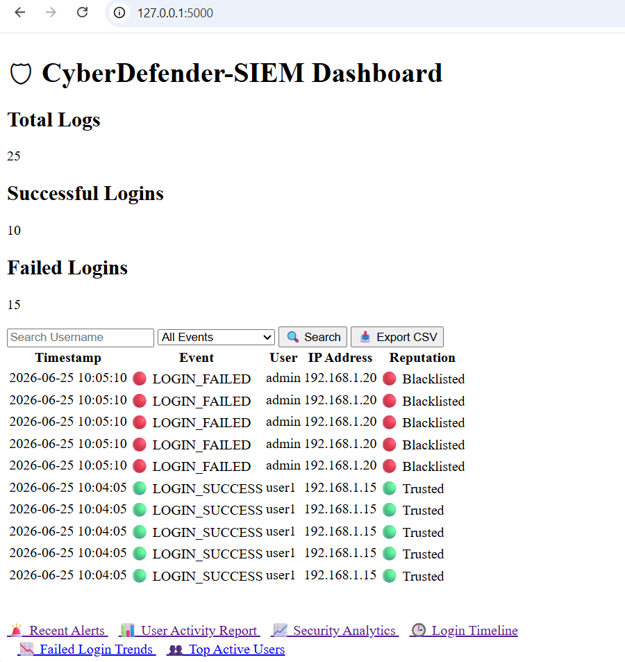

---

## 📅 Day 19 - Event Statistics Dashboard

### 🚀 Features Added

- Added a dedicated **Event Statistics Dashboard**.
- Displays the total number of occurrences for each event type.
- Groups and summarizes security events collected by the SIEM.
- Helps security analysts quickly understand overall event distribution.
- Integrated **Event Statistics** navigation into the main dashboard.
- Improved dashboard reporting with event-wise security insights.

### 🛠 Tools & Technologies Used

- Python
- Flask
- SQLite
- HTML5
- CSS3
- Jinja2
- Visual Studio Code

### 📸 Event Statistics Dashboard

The Event Statistics Dashboard provides an overview of all security events by displaying the total count of each event type. This enables security analysts to monitor event distribution and identify the most frequent security activities within the system.

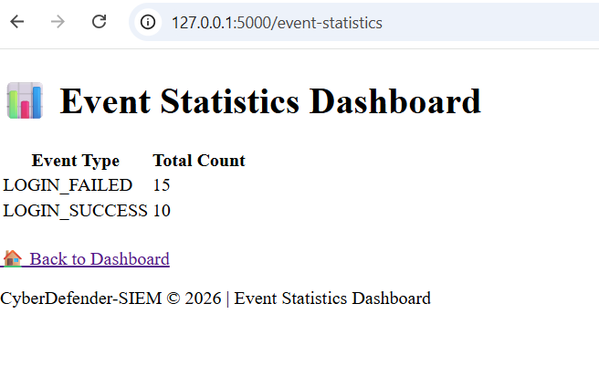

### 📸 Dashboard Navigation

The main dashboard now includes a dedicated **Event Statistics** button for quick access to event-wise security reports and statistics.

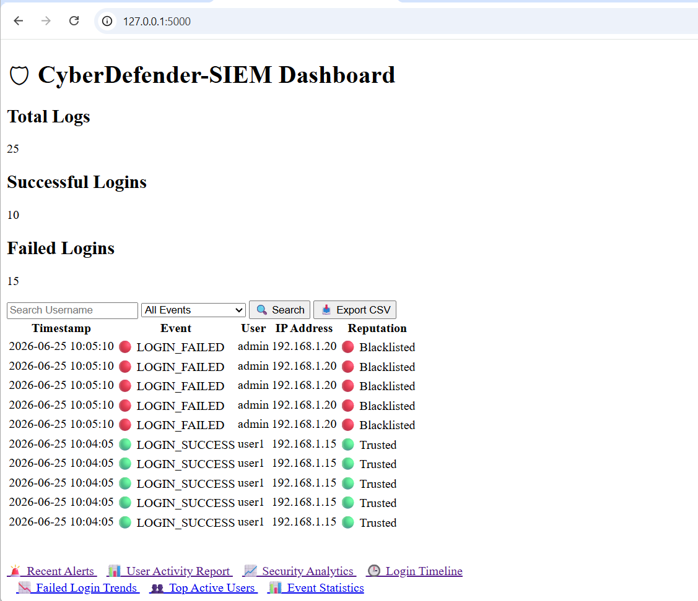

---

## 📅 Day 20 - Suspicious IP Activity Report

### 🚀 Features Added

- Added a dedicated **Suspicious IP Activity Report** page.
- Detects IP addresses with multiple failed login attempts.
- Displays the total number of failed login attempts for each suspicious IP.
- Highlights potentially malicious IP addresses for security monitoring.
- Integrated **Suspicious IPs** navigation into the main dashboard.
- Enhanced the SIEM dashboard with suspicious IP detection and reporting capabilities.

### 🛠 Tools & Technologies Used

- Python
- Flask
- SQLite
- HTML5
- CSS3
- Jinja2
- Visual Studio Code

### 📸 Suspicious IP Activity Report

The Suspicious IP Activity Report identifies IP addresses that have generated multiple failed login attempts. This enables security analysts to quickly detect suspicious login behavior and investigate potential brute-force attacks.

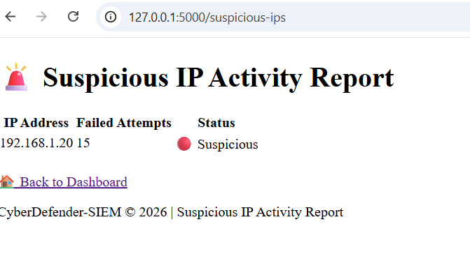

### 📸 Dashboard Navigation

The main dashboard now includes a dedicated **Suspicious IPs** button for quick access to suspicious IP activity and failed login monitoring.

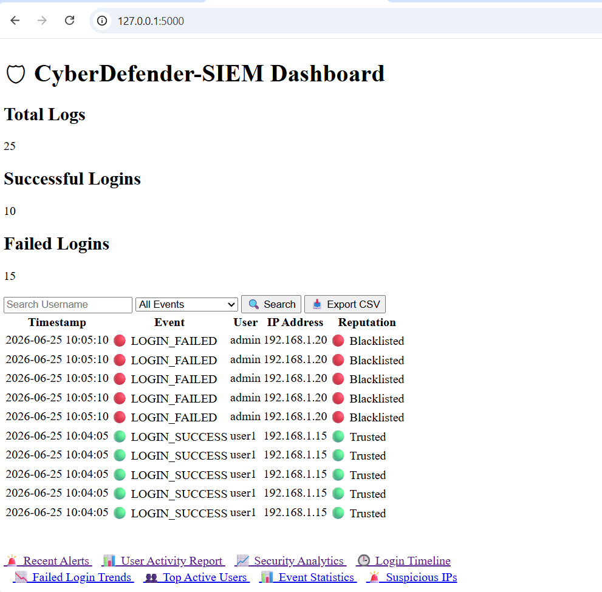

---

## 📅 Day 21 - User Login History

### 🚀 Features Added

- Added a dedicated **User Login History** page.
- Displays a complete chronological history of user login activities.
- Shows login timestamp, username, event type, and IP address.
- Highlights successful logins with green indicators.
- Highlights failed logins with red indicators.
- Integrated **User Login History** navigation into the main dashboard.
- Improved investigation capabilities by providing detailed login records for security analysis.

### 🛠 Tools & Technologies Used

- Python
- Flask
- SQLite
- HTML5
- CSS3
- Jinja2
- Visual Studio Code

### 📸 User Login History Dashboard

The User Login History dashboard provides a chronological view of all user login activities, including successful and failed login attempts. This helps security analysts investigate user behavior, review authentication events, and identify suspicious login patterns.

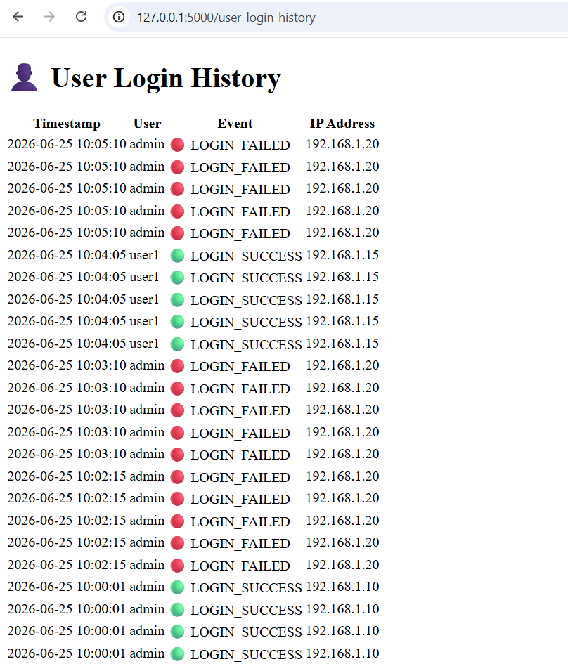

### 📸 Dashboard Navigation

The main dashboard now includes a dedicated **User Login History** button, allowing quick access to detailed user authentication records for security monitoring and incident investigation.

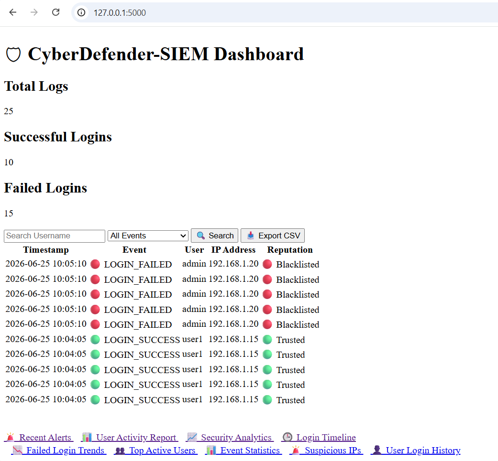

## 📁 Project Structure

CyberDefender-SIEM/
│
├── database/
│   └── siem.db
│
├── screenshot/
│   ├── alert_engine.png
│   ├── brute_force_detection.png
│   ├── severity_classification.png
│   ├── email_alert_terminal.png
│   ├── gmail_alert.png
│   ├── dashboard.png
│   ├── recent_alerts_dashboard.png
│   ├── search_by_username.png
│   ├── filter_login_failed.png
│   ├── search_and_filter.png
│   ├── export_logs_csv.png
│   ├── professional_dashboard.png
│   ├── ip_reputation_dashboard.png
│   ├── blacklisted_ip_detection.png
│   ├── user_activity_report.png
│   ├── dashboard_user_report_button.png
│   ├── security_analytics_dashboard.png
│   ├── dashboard_security_analytics_button.png
│   ├── login_activity_timeline.png
│   ├── dashboard_login_timeline_button.png
│   ├── failed_login_trends.png
│   ├── dashboard_failed_login_trends_button.png
│   ├── top_active_users.png
│   ├── dashboard_top_active_users_button.png
│   ├── event_statistics_dashboard.png
│   ├── dashboard_event_statistics_button.png
│   ├── suspicious_ips_dashboard.png
│   ├── dashboard_suspicious_ips_button.png
│   ├── user_login_history_dashboard.png
│   └── dashboard_user_login_history_button.png
│
├── src/
│   ├── alert_engine.py
│   ├── brute_force.py
│   ├── database.py
│   ├── email_alert.py
│   ├── ip_reputation.py
│   ├── severity.py
│   └── web_dashboard.py
│
├── static/
│   └── css/
│       └── style.css
│
├── templates/
│   ├── alerts.html
│   ├── analytics.html
│   ├── dashboard.html
│   ├── event_statistics.html
│   ├── failed_login_trends.html
│   ├── suspicious_ips.html
│   ├── timeline.html
│   ├── top_active_users.html
│   ├── user_login_history.html
│   └── user_report.html
│
├── main.py
├── requirements.txt
├── README.md
└── .gitignore

---

**Author**

**Nisarga Nayak**