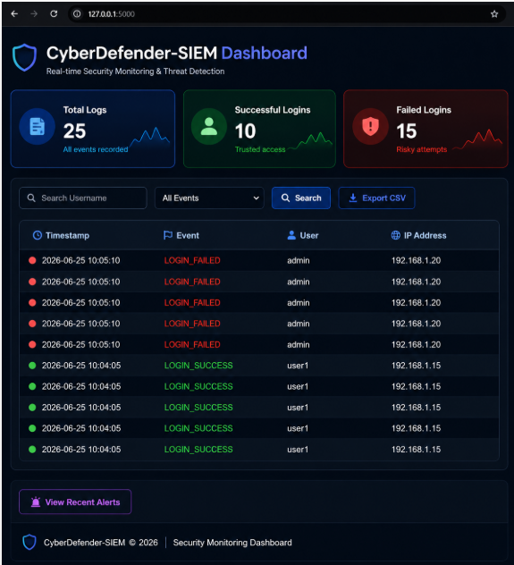
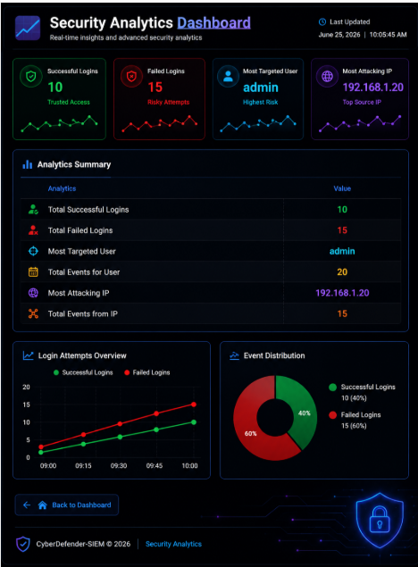
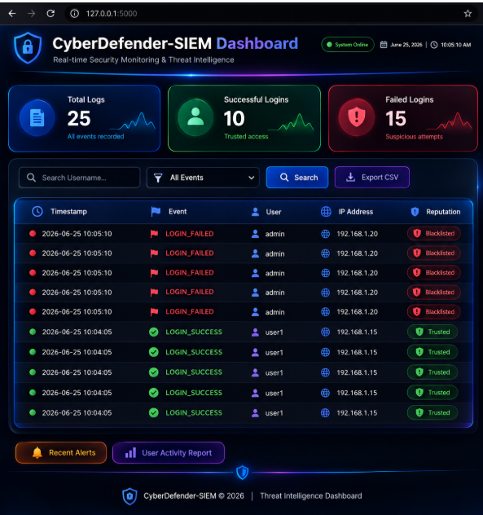
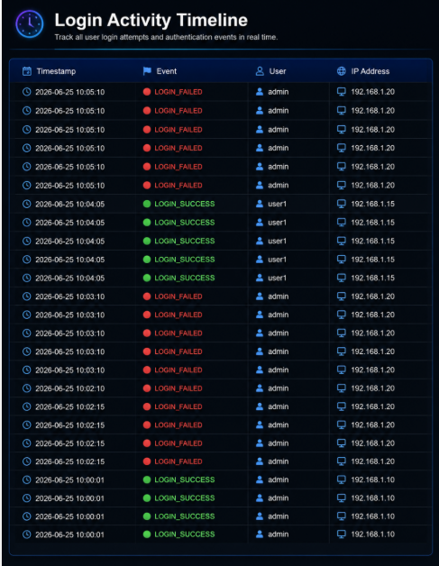
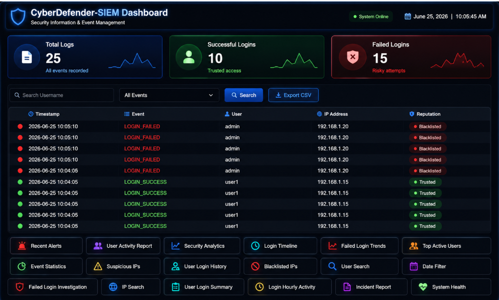
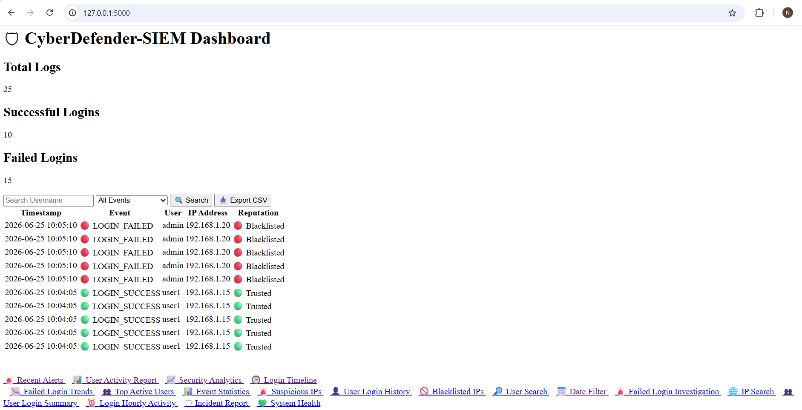

# 🛡 CyberDefender-SIEM


## Intelligent Security Information & Event Management Platform

CyberDefender-SIEM is a Python-based Security Information and Event Management (SIEM) platform developed as an internship project. It collects and analyzes authentication logs, stores security events in a centralized SQLite database, detects suspicious activities such as failed login attempts and brute-force attacks, generates real-time security alerts, and presents security insights through an interactive Flask dashboard featuring security analytics, user activity monitoring, incident investigation, login timeline visualization, and system health reporting.
---

# ✨ Features

- Centralized Log Collection
- Log Parsing & Analysis
- SQLite Database Integration
- Brute Force Detection
- Security Alert Generation
- Security Analytics Dashboard
- User Activity Monitoring
- Login Timeline Analysis
- Incident Reporting
- System Health Monitoring
- CSV Report Export
- User & IP Search

---

# 🔄 SIEM Workflow

```text
Start Application
        │
        ▼
Collect Security Logs
        │
        ▼
Parse & Process Logs
        │
        ▼
Store Events in SQLite Database
        │
        ▼
Threat Detection Engine
        │
        ▼
Generate Security Alerts
        │
        ▼
Update Security Dashboards
        │
        ├──────────────► Security Analytics
        ├──────────────► Incident Reports
        ├──────────────► User Activity Monitoring
        ├──────────────► Login Timeline
        └──────────────► System Health Dashboard
```
---

# 📸 Dashboard Preview

## 🏠 Professional Dashboard



---

## 📊 Security Analytics



---

## 👤 User Activity Report



---

## 📈 Login Timeline



---

## 🚨 Incident Report



---

## 💚 System Health Dashboard



---

# 🏗 Project Architecture

```text
               CyberDefender-SIEM

             Flask Web Dashboard
                     │
                     ▼
              Log Collection
                     │
                     ▼
                Log Parser
                     │
                     ▼
              SQLite Database
                     │
        ┌────────────┼────────────┐
        ▼            ▼            ▼
 Threat Engine   Alert Engine   Analytics
        │            │            │
        └────────────┼────────────┘
                     ▼
          Security Monitoring Reports
```
---

# 📁 Project Structure

```text
CyberDefender-SIEM/
│
├── alerts/
├── database/
├── logs/
├── screenshots/
├── src/
├── static/
├── templates/
│
├── main.py
├── README.md
├── requirements.txt
├── LICENSE
└── .gitignore
```
---
# 🛠 Technology Stack

| Component | Technology |
|-----------|------------|
| Language | Python 3 |
| Backend | Flask |
| Database | SQLite |
| Frontend | HTML5, CSS3, Jinja2 |
| Threat Detection | Python |
| Reporting | CSV Export |
| Version Control | Git & GitHub |

---

### 🚀 Getting Started

### Clone Repository

```bash
git clone https://github.com/nisargarnayak22-lgtm/CyberDefender-SIEM.git
```

```bash
cd CyberDefender-SIEM
```

### Create Virtual Environment

```bash
python -m venv venv
```

### Activate Virtual Environment

**Windows**

```bash
venv\Scripts\activate
```

**Linux / macOS**

```bash
source venv/bin/activate
```

### Install Dependencies

```bash
pip install -r requirements.txt
```
---

# ▶ Running the Project

### Start the Flask Application

```bash
python src/web_dashboard.py
```

Open your browser and visit:

```text
http://127.0.0.1:5000
```

---

# 📄 Documentation

The project includes comprehensive documentation covering the core modules and architecture of the SIEM platform.

- 📌 System Architecture
- 📌 Threat Detection Engine
- 📌 Security Dashboard
- 📌 Database Design
- 📌 Incident Reporting
- 📌 User Activity Monitoring
- 📌 System Health Dashboard

---

### 👨‍💻 Author

Nisarga Nayak

B.Tech – Computer Science & Engineering (Networks)

Presidency University

GitHub

https://github.com/nisargarnayak22-lgtm

linkedin

in/nisarga-nayak